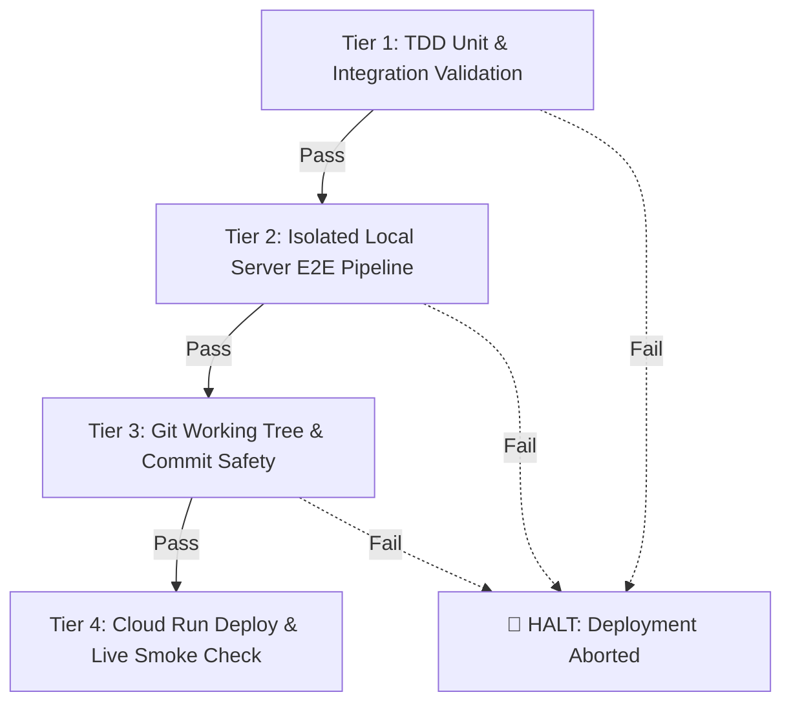

# BigQuery Agentic Demo Engine — Pre-Commit & Pre-Deployment E2E Verification Gate

This skill enforces a mandatory **4-Tier Quality Gate** before committing code or building/deploying new revisions to Google Cloud Run (`bq-agents-v2`). It prevents production regressions, broken conversational agents, missing table schemas, and unverified queries from being deployed.

---

## 1. Quick Execution

To execute the entire 4-tier gate and safely deploy to Cloud Run:

```bash
# Safe deployment with pre-commit validation and automatic commit:
python3 scripts/deploy_with_e2e_gate.py --commit-msg "feat(p2p): add reverse etl continuous query sync"

# Or via bash wrapper:
./scripts/deploy.sh -m "fix(gemini): resolve 502 retry with backoff"
```

### Dry-Run / Verification Only (Without Deploying to Cloud Run):
To run all TDD and isolated local server E2E checks without triggering a Cloud Run build:

```bash
python3 scripts/deploy_with_e2e_gate.py --skip-deploy
```

---

## 2. The 4-Tier Verification Architecture

Every deployment runs sequentially through 4 strict quality gates. If any step fails, the pipeline aborts immediately:



### Tier 1: TDD Unit & Integration Suites
- **Property Graph DDL & Semantic Measures (`scripts/test_property_graph_tdd.py`)**:
  - Validates `CREATE OR REPLACE PROPERTY GRAPH` syntax.
  - Verifies node/edge definitions and `MEASURE(AGG_FUNC(col)) AS measure_name` declarations.
- **Conversational Agents & Canonical A2A Protocols (`scripts/test_conversational_agents_tdd.py`)**:
  - Validates Canonical A2A JSON cards with 10 extensions and `INTERNAL_HTTP+JSON` transport.
  - Validates OAuth 2.0 authorization scope `https://www.googleapis.com/auth/cloud-platform`.

### Tier 2: Isolated Local Server E2E Pipeline
- Launches a temporary Node.js backend on a dynamically allocated local port (`scripts/run_e2e_local_isolated.py --cleanup`).
- Tests real Google Cloud interactions:
  1. `POST /api/research` -> 8 strategic use cases & regional system profile.
  2. `POST /api/generate-data` -> 10k Medallion Lakehouse foundation + Graph DDL.
  3. `POST /api/deploy-bronze` -> BigQuery dataset & table materialization.
  4. `POST /api/vertex/create-bq-data-agent` -> BigQuery compiler dry-run query validation + registration of 3 verified golden queries in both `publishedContext` and `stagingContext`.
  5. `POST /api/gemini-enterprise/deploy-agent` -> Gemini Enterprise A2A registration.
- Automatically cleans up provisioned test assets.

### Tier 3: Git Safety & Commit Validation
- Checks working tree status.
- If uncommitted changes exist and `--commit-msg` is provided, automatically stages and creates a clean commit.

### Tier 4: Production Cloud Run Deployment & Live Smoke Check
- Builds and deploys the container revision to Cloud Run (`bq-agents-v2` in `us-central1`).
- Runs an instant live smoke test against the deployed revision (`https://bq-agents-v2-491843444042.us-central1.run.app/api/generate-agents`).

---

## 3. CLI Options Reference

| Argument | Shorthand | Description |
| :--- | :--- | :--- |
| `--commit-msg` | `-m` | Optional git commit message to stage and commit modified files |
| `--skip-deploy` | | Runs Tiers 1-3 only without deploying to Cloud Run (great for PR/local validation) |
| `--skip-e2e` | | Skips the local server E2E test (use only for emergency hotfixes) |
| `--company` | | Target company for the isolated E2E test (default: `www.vivo.com.br`) |

---

## 4. Best Practices for Agents & Developers
1. **Always run `--skip-deploy` locally before opening pull requests or committing large refactors.**
2. **Never deploy directly with `gcloud run deploy` without running the pre-deploy gate.**
3. **Inspect `tests/e2e_runs/latest_run.json` if any stage in Tier 2 encounters unexpected responses.**
