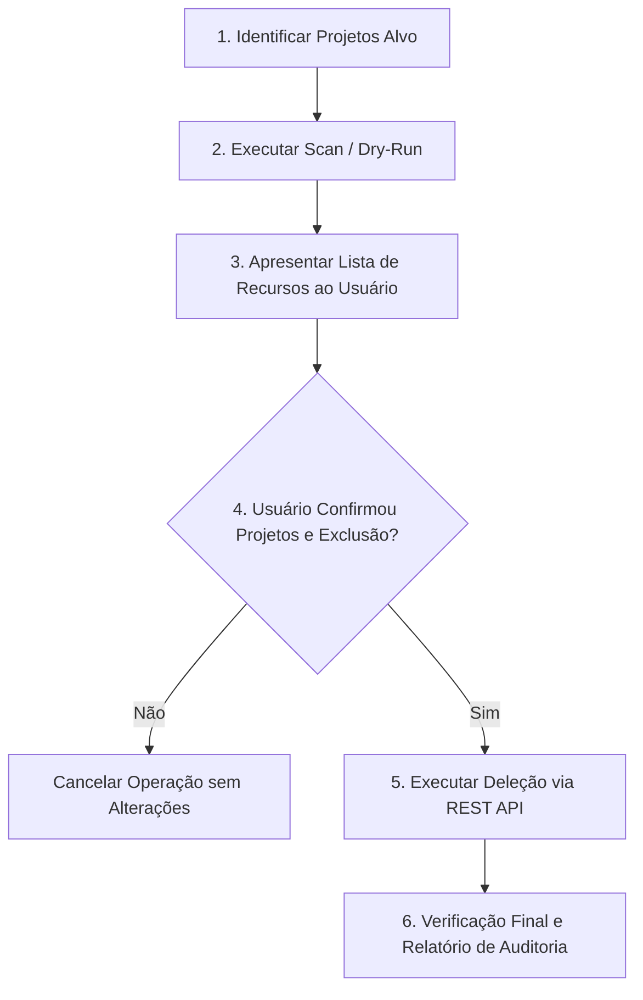

# Gemini Enterprise & BigQuery Conversational Analytics Cleanup

Esta skill define as regras, procedimentos e ferramentas automatizadas para inspecionar, auditar e limpar de forma segura agentes conversacionais e autorizações órfãs nos ecossistemas:
1. **Gemini Enterprise / Vertex AI Search (Discovery Engine API)** (`discoveryengine.googleapis.com`).
2. **BigQuery Conversational Analytics (Gemini Data Analytics API)** (`geminidataanalytics.googleapis.com`).

---

## 1. Arquitetura de Recursos e APIs

### A. Gemini Enterprise (Discovery Engine)
* **Agentes Customizados**: Registrados em `collections/default_collection/engines/{engineId}/assistants/default_assistant/agents/{agentId}`.
* **Autorizações OAuth 2.0 / A2A**: Recursos dedicados 1:1 registrados em `projects/{projectId}/locations/global/authorizations/{authId}`.
* **Header de Quota Obrigatório**: Chamadas à API `discoveryengine.googleapis.com` autenticadas via ADC/gcloud **devem** incluir o header `X-Goog-User-Project: <project_id>` para evitar o erro `403 USER_PROJECT_DENIED: Caller does not have required permission to use project`.
* **Proteção de Agentes do Sistema**: Agentes gerenciados nativos como o `deep_research` (que contêm a propriedade `managedAgentDefinition`) **nunca devem ser excluídos**.

### B. BigQuery Conversational Analytics (Gemini Data Analytics)
* **Data Agents**: Criados no BigQuery para queries semânticas em Property Graphs ou tabelas analíticas.
* **Localização**: Recursos localizados em `projects/{projectId}/locations/{location}/dataAgents/{agentId}`.
* **Regiões Comuns**: `global`, `us`, `us-central1`, `southamerica-east1`, `europe-west1`.

---

## 2. Fluxo Operacional Obrigatório (Protocolo de Segurança)

Ao executar a limpeza, o assistente ou operador deve seguir rigorosamente as seguintes etapas:



### Etapa 1: Identificar e Confirmar Projetos
Sempre solicite confirmação dos IDs dos projetos GCP antes de disparar a deleção real de recursos.

### Etapa 2: Escaneamento (Dry-Run)
Liste previamente todos os agentes e autorizações encontradas sem realizar mutações:
```bash
python3 ~/.gemini/config/skills/gemini-enterprise-cleanup/scripts/clean_gemini_enterprise.py \
  --projects <PROJECT_1> <PROJECT_2> \
  --dry-run
```

### Etapa 3: Exclusão com Confirmação
Após o consentimento explícito do usuário, execute a limpeza:
```bash
python3 ~/.gemini/config/skills/gemini-enterprise-cleanup/scripts/clean_gemini_enterprise.py \
  --projects <PROJECT_1> <PROJECT_2>
```

Para automações não interativas:
```bash
python3 ~/.gemini/config/skills/gemini-enterprise-cleanup/scripts/clean_gemini_enterprise.py \
  --projects <PROJECT_1> <PROJECT_2> \
  --yes
```

---

## 3. Especificação dos Endpoints REST

### 1. Discovery Engine Assistant Agents
* **Listar Agentes**:
  `GET https://discoveryengine.googleapis.com/v1alpha/projects/{project}/locations/global/collections/default_collection/engines/{engineId}/assistants/default_assistant/agents`
* **Deletar Agente Customizado**:
  `DELETE https://discoveryengine.googleapis.com/v1alpha/projects/{project}/locations/global/collections/default_collection/engines/{engineId}/assistants/default_assistant/agents/{agentId}`
  *Header Obrigatório*: `X-Goog-User-Project: {project}`

### 2. Discovery Engine Authorizations
* **Listar Autorizações**:
  `GET https://discoveryengine.googleapis.com/v1alpha/projects/{project}/locations/global/authorizations`
* **Deletar Autorização**:
  `DELETE https://discoveryengine.googleapis.com/v1alpha/projects/{project}/locations/global/authorizations/{authId}`
  *Header Obrigatório*: `X-Goog-User-Project: {project}`

### 3. BigQuery Data Analytics Agents
* **Listar Data Agents**:
  `GET https://geminidataanalytics.googleapis.com/v1beta/projects/{project}/locations/{location}/dataAgents?pageSize=100`
* **Deletar Data Agent**:
  `DELETE https://geminidataanalytics.googleapis.com/v1beta/projects/{project}/locations/{location}/dataAgents/{agentId}`

---

## 4. Tratamento de Erros e Boas Práticas

| Erro / Situação | Causa Raiz | Ação Recomendada |
| :--- | :--- | :--- |
| `403 USER_PROJECT_DENIED` | Chamada ao Discovery Engine sem projeto de cota | Injetar header `X-Goog-User-Project: <project_id>` |
| `400 FAILED_PRECONDITION: ... is used by another agent` | Tentativa de deletar autorização ainda vinculada | Deletar os agentes do Discovery Engine **antes** de deletar as autorizações |
| `Agent: deep_research` | Agente gerenciado nativo do sistema | **Pular** e preservar na lista de agentes |
| Multi-região em Data Agents | Agentes podem estar em `global`, `us` ou regionais | Varrer todas as regiões suportadas (`global`, `us`, `us-central1`, `southamerica-east1`) |
